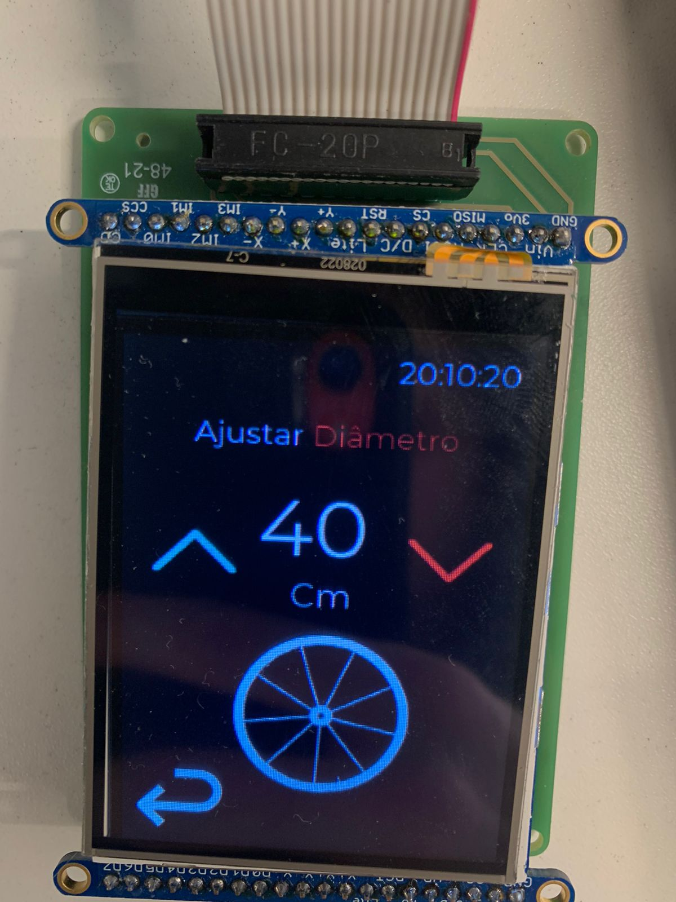

# APS2 - Ciclocomputador

O marketing de uma empresa de equipamentos esportivos quer criar um novo ciclocomputador e você foi escolhido como desenvolvedor autônomo, dado seu background técnico e de UX, para criar um protótipo e validar a ideia.

Mais detalhes no site da disciplina:

- https://insper.github.io/ComputacaoEmbarcada/navigation/APS/APS-2-Bike/Descricao/

## Detalhes

Integrantes:

- Gabriel Hermida 
- Pedro Civita

Nome da marca:

- NightRide

Logo:

# Interface

## Proposta UX 1 - C

> - Mockup da interface:
>    - Satisfaz todos os requisitos do projeto
>    - Indica quais são os widgets do LVGL 
>    - Apresentar uma foto da interface sendo executada no LCD (imagem estática)
> - Grava um vídeo explicando a interface

### Descricão da primeira proposta da interface:

- ### Sequência de telas da primeira proposta

- ### Sequência de telas da primeira proposta no LCD

- ### Imagem explicando os widgets do LVGL

## Proposta UX 2 - B

> - Especifica e justifica quais vão ser as fontes (e tamanhos) a serem usadas na interface.
> - Pega feedback com o Luiz do Fablab e incorpora na interface
>   - Grava em vídeo a entrevista
> - Grava um vídeo atualizado explicando o que foi sugerido e o que fizeram para melhorar a interface
> - Apresentar uma foto da interface sendo executada no LCD (imagem estática)

### Escolha da Fonte Montserrat:

A fonte *Montserrat* é uma escolha popular para interfaces digitais devido à sua alta legibilidade e estilo moderno. Ela foi projetada para ser clara e legível em diferentes tamanhos e resoluções, o que é ideal para displays com capacidades limitadas de renderização de fontes, como é o caso do LCD. Além disso, Montserrat possui uma geometria agradável e formas abertas, o que ajuda na legibilidade mesmo em tamanhos menores.

A *Montserrat*, sendo uma fonte *sans-serif*, também ajuda a manter a interface limpa e moderna, sem os enfeites desnecessários que as fontes com serifa podem ter, o que poderia reduzir a clareza em um display pequeno.

Em suma, a seleção de *Montserrat* e a hierarquia de tamanho propostas têm como objetivo maximizar a usabilidade e a experiência do usuário durante o uso noturno do ciclocomputador, mantendo uma aparência moderna e profissional.

### Fontes e Tamanhos:

- **Maior Tamanho para Velocidade Atual (*Montserrat* Regular)**: Como é o dado mais crítico para o ciclista em movimento, deve ser o mais destacado para leitura rápida e fácil.

- **Tamanho Médio para Textos no Geral (*Montserrat* Regular)**: Para informações importantes mas secundárias como "Seu Trajeto", "Distância", "Vel. Média", e "Tempo", que precisam ser legíveis mas não tão imediatas quanto a velocidade.

- **Menor Tamanho para o Horário e Ícones (*Montserrat* Regular)**: Estas são informações complementares que o usuário consulta esporadicamente, portanto, podem ser menores para não competir com os dados principais.

### Detalhes da segunda interação da proposta de interface:

Adicionado um roller com aros pré definidos na aba de alterar o diâmetro da roda, seguindo as orientações do Luiz, técnico do FabLab do Insper.

### Sugestão do Luiz do Fablab

### Alterações aplicadas à arquitetura

### Sequência de telas da segunda proposta

### Sequência de telas da segunda proposta no LCD

## Proposta UX 3 - A

> - Especifica e justifica as cores a serem usadas na interface
> - Pega feedback com mais uma pessoa externa e incorpora na interface
>     - Grava em vídeo a entrevista
> - Grava um vídeo atualizado explicando o que foi sugerido e o que fizeram para melhorar a interface
> - Apresentar uma foto da interface sendo executada no LCD (imagem estática)

### Paleta de Cores:

- *#000000* (Preto): Para o fundo da interface. Um fundo preto reduz a emissão de luz, o que é menos cansativo para os olhos em ambientes escuros e ajuda a preservar a visão noturna dos usuários.

- *#FFFFFF* (Branco): Para textos e ícones. O contraste elevado com o fundo preto melhora a legibilidade e permite que os usuários leiam rapidamente as informações.

- *#F42135* (Vermelho): Para destacar informações críticas sem comprometer a visão noturna. A luz vermelha é tradicionalmente usada em ambientes de baixa luminosidade pois não causa a constrição das pupilas, mantendo a visão adaptada à escuridão.

- *#21F4E0* (Azul Ciano): Para elementos interativos como botões e controles deslizantes. O ciano é complementar ao vermelho no espectro de cores e cria um contraste visual que pode ajudar a distinguir elementos clicáveis, seguindo as heurísticas de usabilidade de Nielsen.

### Detalhes da terceira interação da proposta de interface:

Nossa segunda opinão foi a do aluno Luca Mizrahi, que sugeriu a adição de um label de aceleração na página anterior à do trajeto iniciado, para que o usuário possa saber se está acelerando ou desacelerando antes de iniciar o trajeto. Acreditamos que essa é uma boa sugestão, pois permite que o usuário se prepare para iniciar o trajeto com a velocidade desejada.

### Arquitetura alterada seguindo sugestões do Luca

### Sequência de telas da terceira proposta

### Sequência de telas da terceira proposta no LCD

